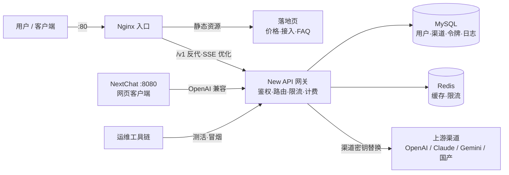

# RelayGate · LLM API Gateway

基于成熟开源组件编排的 **LLM API 聚合网关平台**：多上游渠道聚合、统一 OpenAI 兼容出口、
令牌倍率计费、SSE 流式优化，配套渠道测活、故障演练、CI 集成回归的完整运维工具链。


## 架构



**一次请求的链路**：客户端携带 `sk-` 令牌 → Nginx 反代 → 网关鉴权（令牌/额度/权限）→
路由选渠道（权重/优先级/故障切换）→ 网关以**渠道密钥**替换客户令牌后转发上游 →
SSE 流式透传 → 按 usage × 倍率记账。客户端与上游凭证全程隔离。

## 核心能力

| 能力 | 实现 |
|---|---|
| 多渠道聚合 | New API：渠道管理、模型映射、权重分流、故障自动切换 |
| 计费体系 | 三层倍率（模型 × 补全 × 分组），1 USD = 500,000 quota，全量调用日志 |
| 流式体验 | Nginx SSE 专项优化（`proxy_buffering off` + 300s 超时），TTFT / TPOT 可量化 |
| 运维工具链 | 渠道测活脚本（TTFT、流式完整性）、网关冒烟与故障演练（401/403/503/SSE） |
| 可观测性 | 全链路 request id 追踪、容器日志、用量对账查询 |
| 质量保障 | GitHub Actions CI：compose 校验 + Python 语法 + mock 上游集成回归 |
| 集成测试夹具 | `mock_upstream.py`：OpenAI 兼容上游模拟器（含 SSE），零成本联调与回归 |

## 快速开始

```bash
cp .env.example .env
docker compose up -d
```

| 入口 | 地址 | 说明 |
|---|---|---|
| 门户页 | http://localhost | 价格表、接入教程、FAQ |
| 管理控制台 | http://localhost:3000 | 渠道 / 令牌 / 倍率 / 日志（首次启动初始化管理员） |
| 网页客户端 | http://localhost:8080 | NextChat，访问码见 compose |
| API 端点 | http://localhost/v1 | OpenAI 兼容，任何 SDK 可直接接入 |

## 接入上游渠道

管理控制台 → 渠道 → 添加（类型 / Base URL / 密钥 / 模型列表 / 权重），
再于运营设置中配置模型倍率，最后在令牌页发放 `sk-` 密钥。

本地联调与回归测试可先挂 `scripts/mock_upstream.py`（OpenAI 兼容上游模拟器，
含 SSE 流式），接入真实渠道时代码与配置结构零改动——**CI 中的集成测试即基于它运行**。

## 计费速算

- 基准：1× = $2 / 百万输入 token；模型倍率 = 官方输入价（$/1M）÷ 2
- 扣费 quota = (输入 tokens × 模型倍率 + 输出 tokens × 模型倍率 × 补全倍率) × 分组倍率
- 示例：gpt-4o（1.25×，补全 4×）100 万输入 + 50 万输出 = $7.5，与官方定价完全一致

## 运维工具链

```bash
make up      # 启动全栈        make down    # 停止
make logs    # 跟踪网关日志    make probe   # 渠道测活（TTFT/流式完整性）
make test    # 冒烟 + 故障演练（KEY=令牌 MODEL=模型名）
```

```bash
python scripts/channel_probe.py --config scripts/channels.json      # 渠道验收
python scripts/smoke_test.py --key sk-xxx --model mock-1            # 全链路冒烟
python scripts/mock_upstream.py                                      # 启动模拟上游
```

## 项目结构

```
├── docker-compose.yml       # 全栈编排：nginx + new-api + chat + mysql + redis
├── nginx/
│   ├── gateway.conf          # 入口配置：静态站点 + /v1 反代 + SSE 优化 + 限流示例
│   └── html/index.html       # 门户页（价格 / 接入教程 / FAQ）
├── scripts/
│   ├── mock_upstream.py      # OpenAI 兼容上游模拟器（集成测试夹具，CI 在用）
│   ├── channel_probe.py      # 渠道测活：状态码 / 延迟 / TTFT / 流式完整性
│   ├── smoke_test.py         # 网关冒烟与故障演练（401/403/503/200/SSE）
│   └── channels.json         # 渠道清单
├── docs/运维手册.md           # 渠道验收清单 / 工单排障 FAQ / 常用命令
├── .github/workflows/ci.yml  # CI：compose 校验 + 语法检查 + 集成回归
└── Makefile                  # 常用命令入口
```

## 测试与验证

- 冒烟测试 5/5：401（无鉴权 / 错误密钥）、503（无可用渠道）、200（正常调用带 usage）、SSE 流式（`[DONE]` 收尾）
- 令牌隔离验证：上游侧仅见渠道密钥，客户端令牌不出网关
- 每次推送自动执行 CI（见顶部徽章）

## License

[MIT](./LICENSE)
